# 数据可视化期末项目


---

**姓名：** 王艺楷、冉诗菡、何占魁

**学号：** 15300180076、15307130424、15307130175

---


## 任务：FFD三维形变平台 

>1. 作业以小组形式:每个小组3个人。提交作业时只要一个代表提交就可以。记住:不要多人重复提交。 
>2. 提交内容包括: 
>   - 报告:在报告中清晰描述问题和数据，数据处理的各个步骤及中间结果，代码结构，开发环境，可执行文件使用手册等细节问题。 
>   - 代码:使用Python(Matlab或C/C++)开发;代码要有非常清晰的注释。 
>   - 提交可执行文件 
>   - 测试数据 
>   - 鼓励用视频解释可视化操作过程与展示结果 
>3. 截止时间
>   - 6月24日23:00 (16周结束)
>   - 7月22日23:00 (20周结束，难度和完成分:(A/10)^2) 

### 一、问题和数据：

##### 1. 问题描述：

基于VTK或其他显示库开发一个具有GUI功能的工具，用于实现3D Free-Form Deformation (FFD)的可视化和交互。

功能要求：

- 可以人工设置调节每个控制点的位移
- 可以读入FFD文件设置位移，输出FFD(.FFD格式)
- 可视化形变场，如使用网格线和surface model(vtk polydata格式)


##### 2. 数据描述：

###### OBJ文件：

OBJ文件是Wavefront公司为它的一套基于工作站的3D建模和动画软件"Advanced Visualizer"开发的一种文件格式。OBJ文件是一种文本文件，可以直接用写字板打开进行查看和编辑修改。支持多边形(Polygon)，直线(Lines)，表面(Surfaces)，和自由形态曲线(Free-form Curves)。直线和多角形通过它们的点来描述，曲线和表面则根据于它们的控制点和依附于曲线类型的额外信息来定义。这些信息支持规则和不规则的曲线，包括那些基于贝塞尔(Bezier)曲线，B样条(B-spline)，基数(Cardinal/Catmull-Rom样条)，和泰勒方程(Taylor equations)的曲线。

OBJ文件由一行行文本组成，注释行以一个 # 号为开头，空格和空行可以随意加到文件中以增加文件的可读性。有字的行都由一两个标记字母也就是关键字(Keyword)开头，关键字可以说明这一行是什么样的数据。多行可以逻辑地连接在一起表示一行，方法是在每一行最后添加一个连接符(\)。

在我们的OBJ文件中，以v关键字开头的行表示几何体的顶点数据，以f关键字开头的行表示几何体的面数据。


###### FFD文件：

FFD文件是一种自定义文件格式，用来存储进行FFD变换后每个控制点的位移数据。

FFD文件的每个区域以双##开头，##内部表明从下一行开始的数据含义，如dimension，offsets等。从##的下一行开始到下一个##号或文件截止为该##号所描述的数据内容。控制点的位移由一个三维的数组表示，具体的：设三个维度为$[x,y,z]$,不同的x维度之间以一个空行隔开，同一x维之间不同的y维由一个换行符隔开，同一xy维之间不同的z维由一个tab隔开，每个xyz维存储一个三维的控制点位移，每个维度之间由空格隔开。


### 二、数据处理：

##### 1. 算法描述：

###### 3D Free-Form Deformation (FFD)

FFD的主要目的是通过对全局形变函数和局部形变函数的构造达到对非刚性形变的模拟。即将形变函数:
$$
\textbf{T}:(x,y,z)\rightarrow (x^{'},y^{'},z^{'})
$$
构造为为全局形变函数和局部形变函数的组合：
$$
\textbf{T}(x,y,z)=\textbf{T}_{global}(x,y,z)+\textbf{T}_{local}(x,y,z)
$$
其中，全局性变函数是一个自由变换(affine transformation).定义为：
$$
\textbf{T}_{global}(x,y,z)=\left(\begin{matrix}\theta_{11}&\theta_{12}&\theta_{13}\\\theta_{21}&\theta_{22}&\theta_{23}\\\theta_{31}&\theta_{32}&\theta_{33}\end{matrix}\right)\left(\begin{matrix}x\\y\\z\end{matrix}\right)+\left(\begin{matrix}\theta_{14}\\\theta_{24}\\\theta_{34}\end{matrix}\right)
$$
为了定义基于样条函数的局部形变FFD，我们定义物体所占据的区域为$\Omega=\{(x,y,z)|0\leq x<X,0\leq y <Y,0\leq z<Z\}$.定义$\Phi$为体积为$n_x*n_y*n_z$的控制点网络，其中$n_i$为第i个维度相邻控制点之间的距离。那么FFD可以被定义为一维立方B样条的三维张量积：
$$
\textbf{T}_{local}(x,y,z)=\sum_{l=0}^3\sum_{m=0}^3\sum_{n=0}^3B_t(u)B_m(v)B_n(w)\phi_{i+l,j+m,k+n}
$$
其中$i=\lfloor x/n_x\rfloor-1,j=\lfloor y/n_y\rfloor-1,k=\lfloor z/n_z\rfloor-1,\\u=x/n_x-\lfloor x/n_x\rfloor,v=y/n_y-\lfloor y/n_y\rfloor,w=z/n_z-\lfloor z/n_z\rfloor$

样条函数的定义如下:
$$
B_0(u)=\frac{(1-u)^3}{6}\\
B_1(u)=\frac{3u^3-6u^2+4}{6}\\
B_2(u)=\frac{-3u^3+3u^2+3u+1}{6}\\
B_1(u)=\frac{u^3}{6}
$$


 ##### 2. 控制点交互

   - **控制点生成**
     - **确定控制点位置和数量：**首先需要根据读入文件的坐标位置确定控制点的位置，我们在目标物体的周围生成$n\times n\times n$的立方体，立方体的长宽高由物体大小确定，使得该立方体恰好“包裹”住目标物体。
     - **生成球体：**在每一个控制点的位置利用`vtk.vtkSphereWidget()`生成一个球体，并进一步配置球体半径、颜色等属性，我们根据读入物体的大小自适应生成控制点球体的半径大小。
   - **控制点间邻居结点连线生成**
     - **计算邻居结点：**对于每一个控制点球体，计算以它为中心的前后上下左右的六个邻居结点的位置。由于我们完全按照x轴y轴z轴的索引进行访问，该步骤变得更加简洁。
     - **邻居结点连线：**将每个控制点与他们所对应的邻居结点用`vtk.vtkLineSource()`连接起来。
   - **设置控制点监听器**
     - 对于每一个控制点，利用`AddObserver`监听`vtkRenderWindowInteractor`里的事件。
   - **进行交互**
     - 我们定义回调函数`sphereCallback`来实现交互。

     - 在该回调函数中，会对每个控制点球体的位置进行查询，如果球体位置发生更新，则去掉该球体与邻居结点连接的“旧线”，并重新生成该球体与邻居结点的连线，把该球体的新位置返回给FFD算法进行计算形变。

       - ==**注意**==：在这一步中，我们并不对全部球体和球体的邻居进行遍历和重新生成，我们仅仅对发生改变的控制点进行更新，FFD算法也仅对需要改变的点的位置进行改变和重新渲染，进行优化后，速度会更快。改进后的算法速度提升了**80%**左右。

       - 如下图：红色的连线是针对被拖拽的控制点新生成的连线。

         ---

         | 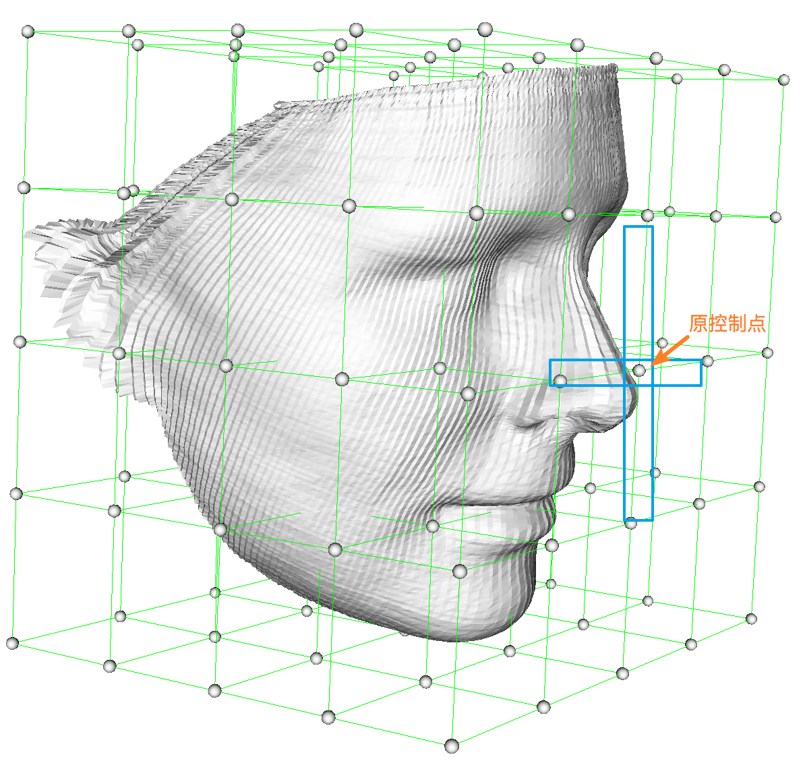 | 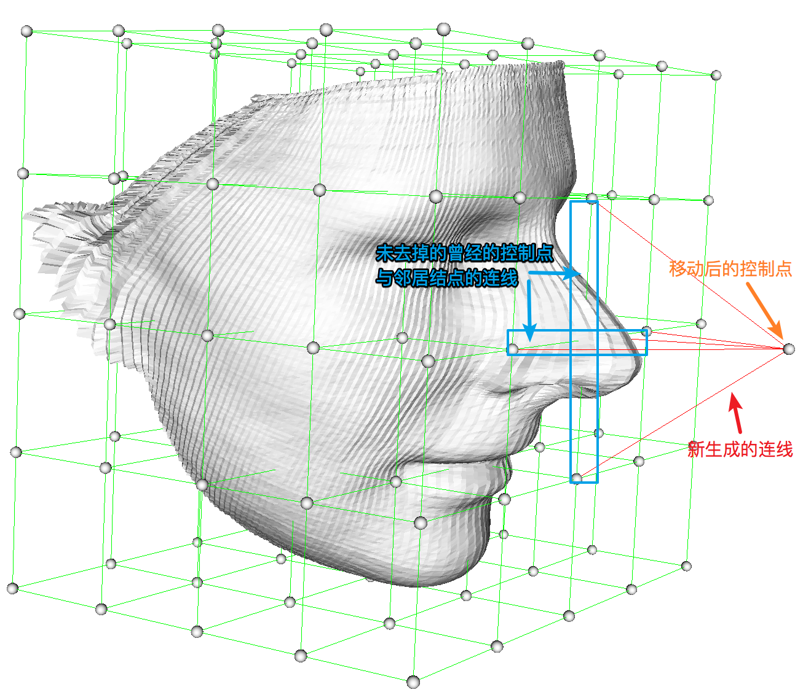 | 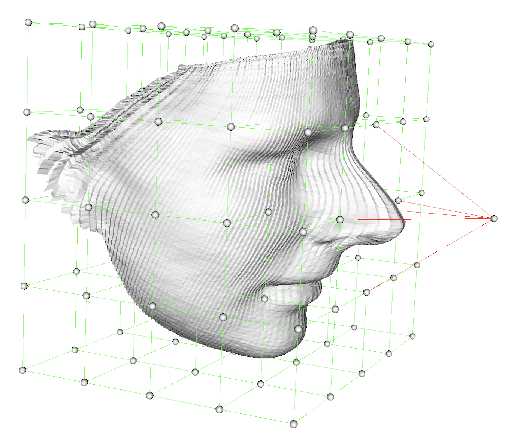 |
         | :--------------------------------------: | :--------------------------------------: | :--------------------------------------: |
         |                    原图                    |               未去掉曾经和邻接点的连线               |               去掉曾经和邻接点的连线                |

         ---


- 获取FFD算法计算好后的数据，用`RemoveActor`去除之前显示的物体并用`AddActor`显示更新形变后的物体。否则会因为重叠造成FFD算法不能实现像内凹陷。


##### 3. 可视化界面GUI

1. ##### 功能描述：

   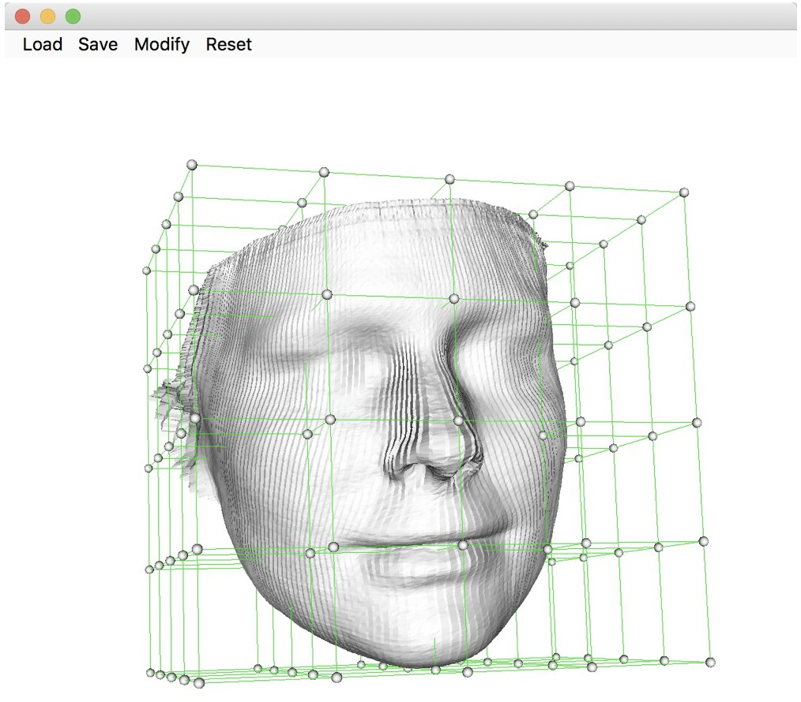

   ​
   我们的GUI示意图如上，其主要部件分为**展示框(DISPLAY)**和**工具栏(LOAD + SAVE + MODIFY + RESET)**，其控制流程如下：

   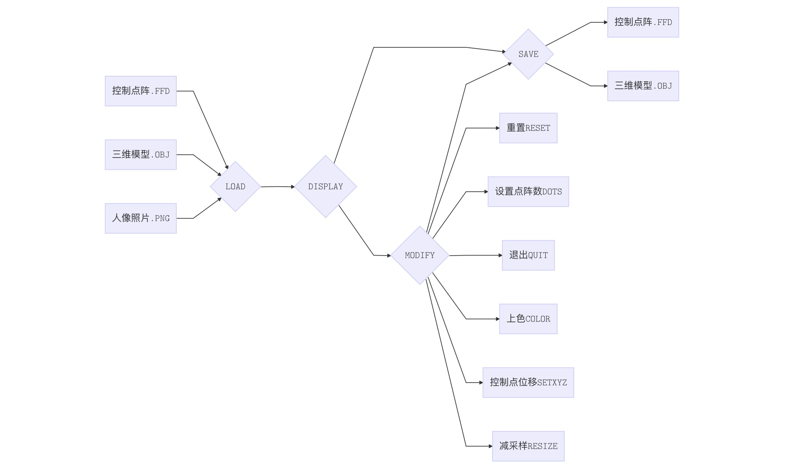

   可以归类为5项文件功能和5项处理功能。其中文件功能中完成常规的**模型、控制点阵的导入导出，**也添加了一个有意思的**3D人脸重建功能**；处理功能中有常规的**重置、设置点阵、设置控制点位移等操作**，也有创新的**减采样**和**上色**功能。功能实现详述如下：
   ​

2. ##### 文件导入和存储：

   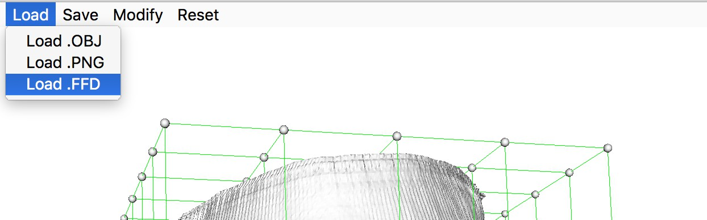

   ​
   **OBJ文件：**我们使用VTK自带的`vtkOBJReader`读取.obj文件，使用`GetOutput()`获得模型的`PolyData`数据集，但是这样存在的问题是，我们无法获得模型每个点和面对应的颜色的RGB值，因此我们再手写了一个读入函数，重新遍历一遍.obj文件，获取$Point\rightarrow RGB$的对应关系。.obj文件读取分为两个部分：

   -  通过VTK的`OBJReader`读取.obj文件进行画图，通过自写`reader`函数存储$Point \rightarrow RGB$。
   -  按照.obj文件的规则读取每个点的坐标，存储到内存中，为FFD算法的计算做准备。

   **FFD文件：** 我们手写了一个读入.ffd文件函数，获取了控制点阵中每个点的(x,y,z)坐标值，以及位置偏移，再通过复用为Modify-Set XYZ中设计的控制点回调函数SphereQt()，将.ffd读入的控制点逐个进行移动。

   **PNG文件：**我们读入人脸的二维照片，再利用论文 [Joint 3D Face Reconstruction and Dense Alignment with Position Map Regression Network](https://arxiv.org/abs/1803.07835) 提出的PRNet对照片中的人脸进行3D重建。模型直接使用已训练好的模型[PRNet](https://github.com/YadiraF/PRNet)，导入带有颜色信息的.obj文件，并通过上文提到的方式读入到VTK中:

   

   **OBJ、FFD文件存储：**由于VTK中并没有`vtkOBJWriter`等函数，我们根据.ffd和.obj文件格式写入新文件，具体方式不在此赘述。

   **注：** **控制点位置确定**的方式值得一提，我们首先由读入的.obj文件计算初始的控制点位置，其次若加载FFD文件则对每一个控制点更新位移。具体的，初始控制点的计算方法为：

       1. 将.obj文件形成的3D人脸嵌入长方体中，计算得出长方体的长宽高。
       2. 根据预先定义的控制点间隔将长方体切割，切割成的每个小长方体的顶点作为控制点的坐标。

   ​

3. ##### 模型处理：

   ---

   | 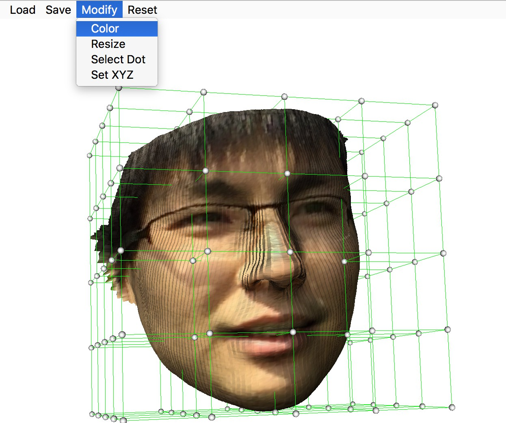 | 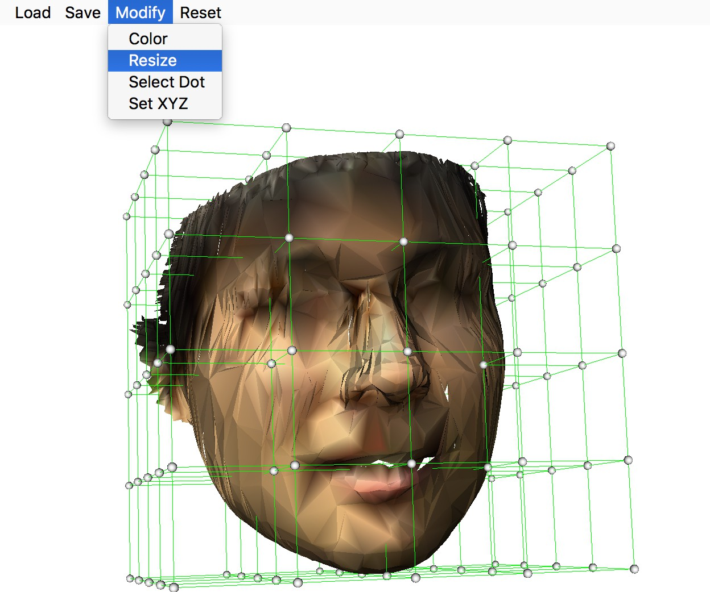 |
   | :------------------------: | :-------------------------: |
   |             上色             |             减采样             |

   ---

   **上色：**我们通过在读入阶段存储好的$Point\rightarrow RGB$信息，利用`VTK`的`SetScalars`添加`PolyData`属性，从而给每个点，以及多个点对应的面片(Cell)进行着色，从而使得模型着色。

   **减采样：**我们通过`VTK`的`SetTargetReduction`函数，设定减采样比例。同时开启**拓扑结构变化**、**允许切割**、**边界顶点(Vertex)剪裁**三项属性，将模型减采样指定比例的信息。该功能的动机是我们的模型形变速度在优化前受到顶点数目的严重制约，在近50000个顶点的人脸模型中完全实现不了实时形变，于是通过减采样功能提高形变速度。

   **注：**值得一提的是，我们的**上色**功能存储的$Point\rightarrow RGB$信息事实上会被**减采样**操作破坏。因此在GUI的实现中，我们在后台实际上维护两个人脸模型，分别为已上色和未上色，通过**同时形变**保证$Point\rightarrow RGB$的对应关系，解决了**上色、减采样**两个功能轮流操作的潜在冲突。

   ---

   | 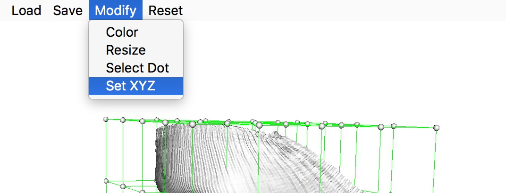 | 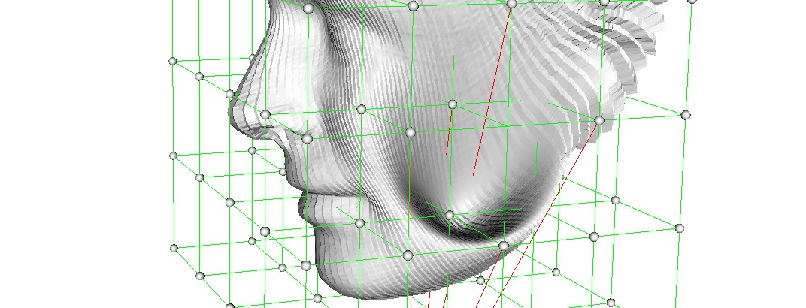 |
   | :--------------------------: | :----------------------------: |
   |            选定控制点             |            确定控制点位移             |

   ---

   **设置控制点位移：** 我们编写函数`SphereQt()`，通过设置控制点的移动，将新的控制点位置传入FFD算法中，通过上述的FFD变换计算出模型点(Point)的新坐标，利用VTK的`SetPoint()`函数更新。

   ​

4. ##### 其他功能：

   ---

   | 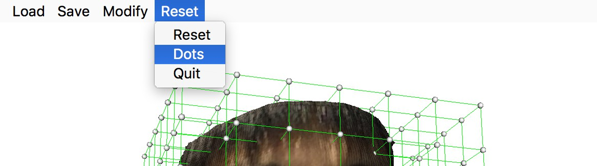 |  |
   | :----------------------: | :-----------------------: |
   |         设置控制点阵数目         |            重置             |

   ---

   此处**控制点阵**设置和**重置**功能非常直观，实现无特异之处，因此不赘述。

   ​

5. ##### 效率提升：

   对于近50000多个点(Points)、80000多个面片的人脸模型FFD形变，我们的原始耗时约9秒。在进行了**控制点回调优化**、人脸点阵记录等处理之后，形变时长与点阵位置相关。其中最长耗时约4.56秒，最短耗时为0.48秒。当前具体耗时如下，测试机器为Macbook Pro 2017，处理器为 Intel Core i5@2.3 GHz：

   |   耗时   | zxh-ape.obj-原型 | zxh-ape.obj - 1%减采样  |     face.obj-原型      |
   | :----: | :------------: | :------------------: | :------------------: |
   | 最长 (s) |      4.56      |         0.55         |         0.14         |
   | 最短 (s) |      0.48      | $9.07\times 10^{-7}$ | $4.6 \times 10^{-4}$ |

   ​


   

#### 三、代码结构：

##### FFD算法(@kai)

```python
class obj_reader(object):
    def __init__(self, filename, swapyz=False):
        """加载obj文件"""
class FFD(object)
    def __init__(self, num_x, num_y, num_z, object_file,object_points):
        """num_x,num_y,num_z,各维度控制点个数
        object_file,obj文件路径
        object_points,obj文件点数据"""
    def initial_ffd(self,initial=True):
        """初始化ffd"""
    def load_cp(self,path):
        """实现加载储存控制点改变值的FFD文件"""
    def save_cp(self,filename):
        """实现将控制点改变值存入FFD文件"""
    def B(self,i,u):
        """计算样条函数值"""
    def T_local(self,object_point):
        """计算FFD"""
    def changed_reset(self):
        """重置被改变的控制点以避免重复计算"""
    def changed_update(self,id,location):
        """更新被改变的控制点"""
    def update_control_point(self):
        """更新控制点位置"""
```


##### 控制点框架

```python
class VtkModel(object):
    def __init__(self, ren=None, iren=None, filename="zxh-ape.obj", RESIZE = 1, COLOR = True, RADISU = 0.01, xl = 4, yl = 4, zl = 4):
        """
        参数初始化和画图初始化
        """
    def ijk2xyz(self, i, j, k):
        """
        i, j, k为控制点在x轴 y轴 z轴方向分别的索引值
        x, y, z为控制点在坐标系中的坐标
        该坐标由ffd算法根据读入进来的物体的大小自动生成 保证控制点为能恰好包裹住物体的长方体
        """
    def neighbor(self, i, j, k):
        """
        找到第i,j,k号球对应的所有邻居球体的索引值
        即:上下左右前后六个点 通过索引值返回即可 记得考虑索引边界情况
        """
    def loadOBJ(self):
        """
        初始化，加载模型.obj格式文件
        """
    def color(self):
        """
        上色：模型上色，仅对于带有RGB信息的.obj文件有效
        """
    def resize(self, RESIZE):
        """
        调整尺寸，对PolyData进行减采样，仅对于Triangle类型有效
        """
    def drawFace(self, COLOR=False, RESIZE=1.0):
        """
        初始化 画出人脸 可以选择是否需要着色以及是否需要压缩图像
        """
    def drawControlPoints(self):
        """
        生成控制点球体
        """
    def drawLines(self):
        """
        初始化画线 生成用于保存线的sourcelist, mapperlist, actorlist
        获取每个控制点球体的位置并保存在spherelocation中
        将每个控制点与其邻居结点连接起来
        """
    def addControlPointsObserver(self):
        """
        对于每一个球体控制点 添加Observer监听vtkRenderWindowInteractor里的事件
        用户方法通过定义一个回调函数sphereCallback并将其作为参数传入AddObserver来定义
        该函数将GUI交互器与用户自定义的渲染交互窗口交互器的方法关联起来
        """ 
    def sphereCallback(self, obj, event):
        """
        对于控制点的回调交互函数
        主要功能为: 
        	检查控制点是否被拽动
        	对于被拽动的控制点: 去掉旧的邻居结点连线并增加新的连线
        					 去掉旧的人脸并调用ffd算法生成新的人脸
        """
```


##### GUI

 ```python
class Ui_MainWindow(object):
    def setupUi(self, MainWindow):
	"""设置UI主界面
	"""
class SimpleView(QtWidgets.QMainWindow):
    def __init__(self, parent=None):
        """继承QMainWindow类，初始化界面
        """
    def initVTK(self, dots=5):
        """初始化VTK
        """
    def showAll(self):
	   """开启界面展示
	   """
    def createActions(self):
       """创建按钮
       """
    def createMenus(self):
       """创建工具栏
       """
    def load_obj(self):
	  """读入.obj文件槽函数"""
	  """后槽函数均结构类似，在此略过"""
 ```


#### 四、开发环境：
-  **系统环境：**macOS High Serria, windows 10
-  **开发语言：**Python>=3.5
-  **软件包：**Numpy>=1.13.0,  TensorFlow >= 1.4


#### 五、可执行文件使用： 

-  **使用环境：**macOS

-  **文件名称**：

-  **使用方式：**

-  **补充说明：**


#### 六、一些尝试：

#### 

#### 七、合作者贡献：

-  **王艺楷：**FFD算法实现，参与GUI实现，算法优化，报告撰写

-  **冉诗菡：**控制点算法及交互实现，算法优化，报告撰写

-  **何占魁：** GUI实现，算法优化，报告撰写

   ​

## 致谢：

衷心感谢下列优秀开源项目：

[PRNet](https://github.com/YadiraF/PRNet)

[3D-FFD-in-VTK](https://github.com/Anthony-Xu/3D-FFD-in-VTK)

感谢庄吓海老师和徐辉学长在我们做pj的过程中对我们的帮助！

